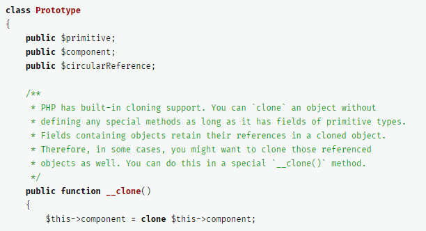

## PATRONES DE DISEÑO

>Hecho por Rukaia Harrous Abdelkader

# ¿Qué es un patrón de diseño?, ¿En qué consiste?
<br>

>Un patrón de diseño es documentación que se utiliza al diseñar un software, esta nos resuelve problemas, se utiliza en PHP y muchos mas lenguajes de programación. 
>Podemos encontrar varios patrones bastante importantes como Singleton y MVC aunque existen muchos mas.
>Los patrones suelen ser bastante diferentes, cada uno con sus caracteristicas pero al fin y al cabo todos hacen la misma cosa, ayudar a los programadores a escribir su código.

# - ¿Por qué aprender sobre patrones?

>Como dije anteriormente, los patrones son casi necesarios ya que ayudan bastante al programador a escribir un buen código y crear softwares de calidad.

<br>

# El patrón que voy a escoger yo es el "Prototype", este se encarga de clonar facilmente sin repetir código y se puede detectar facilmente si vemos la palabra clave *Clone* o *Copy*.

```php
<?php

namespace RefactoringGuru\Prototype\Conceptual;

/**
 * The example class that has cloning ability. We'll see how the values of field
 * with different types will be cloned.
 */
class Prototype
{
    public $primitive;
    public $component;
    public $circularReference;

    /**
     * PHP has built-in cloning support. You can `clone` an object without
     * defining any special methods as long as it has fields of primitive types.
     * Fields containing objects retain their references in a cloned object.
     * Therefore, in some cases, you might want to clone those referenced
     * objects as well. You can do this in a special `__clone()` method.
     */
    public function __clone()
    {
        $this->component = clone $this->component;

        // Cloning an object that has a nested object with backreference
        // requires special treatment. After the cloning is completed, the
        // nested object should point to the cloned object, instead of the
        // original object.
        $this->circularReference = clone $this->circularReference;
        $this->circularReference->prototype = $this;
    }
}
```
>Como podemos observar en la siguiente línea



>Tenemos una variable $component y mas abajo la clonamos para ahorrar repetir todo el código y asi tener un código mas limpio y entendible.

>El uso es bastante fácil, como dije antes utilizamos el *Clone* y le damos lo que queremos dublicar a una nueva variable y ya estaria. 

